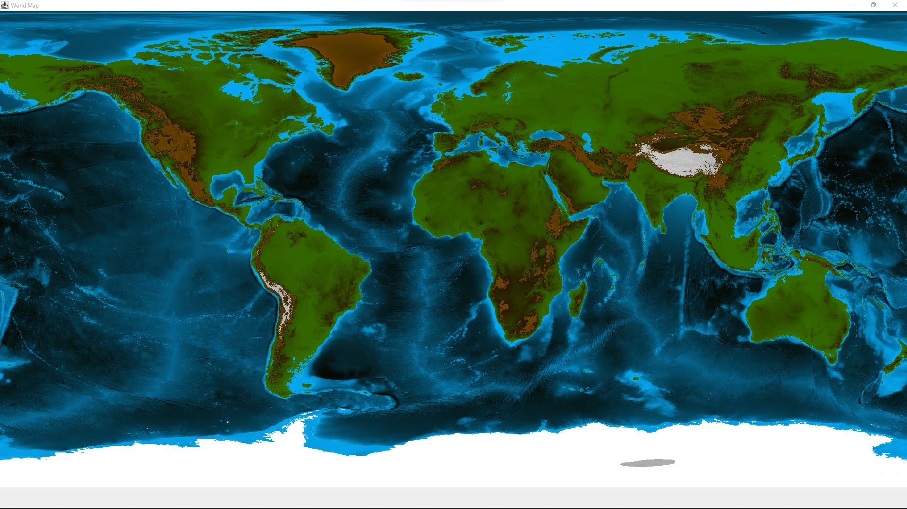
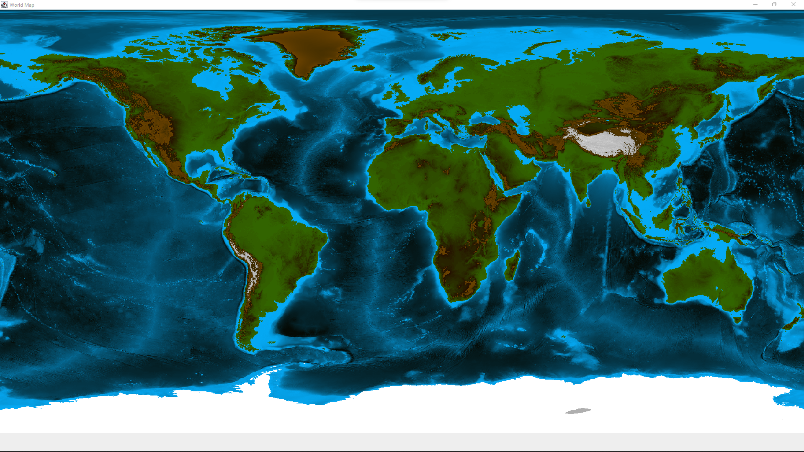
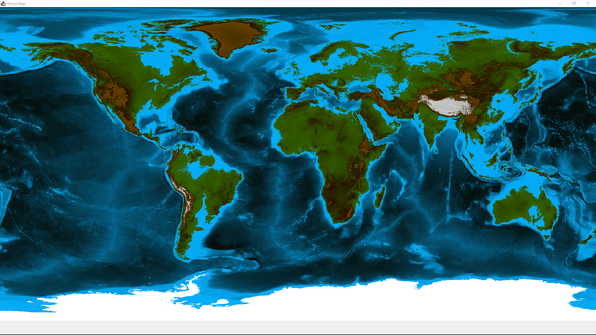

# Sea Level Simulator

## Description
This program simulate the sea levels on a 2D world map. The map is painted using SWING and a file containing coordinates of over 2.3 million points. These x and y coordinates are used for pixel positions and z for pixel color.
Minimum sea level difference that can ve simulated is -100 while the maximum is 100.

## Visual representation
There is not much noticeable difference between the pictures below unless the details are being oberved carefully.
- Sea level simulation: -100
  
- Sea level simulation: 0
  
- Sea level simulation: 100
  